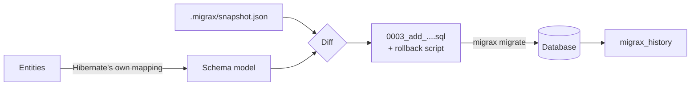

# How Migrax works

## The pieces

**Schema model.** Migrax builds a model of the tables your entities need. When your project has
Hibernate 5.4 or newer, Migrax asks **your own Hibernate version** for its mapping, without
connecting to a database, so names, types, join tables, element collections, inheritance and
sequences are exactly what your application expects. Without Hibernate it scans the
`jakarta.persistence` / `javax.persistence` annotations instead.

**Snapshot.** `.migrax/snapshot.json` records the schema your migrations produce. `generate`
compares the entities with the snapshot and writes only the difference. The snapshot also records
the dialect and [naming strategy](../reference/naming.md), so the names stay stable even if
your configuration changes later.

The very first `generate` has no snapshot, so it compares with the live database instead.

**Migration files.** Migrations live in `src/main/resources/db/migration` and are numbered:
`0001_initial.sql`, `0002_add_customers_phone.sql`, ... The name describes the change. Next to
each generated migration, `rollback/<same name>.sql` undoes it.

**History.** `migrax migrate` records every applied migration in the `migrax_history` table,
with a SHA-256 checksum of the file. Failed attempts are recorded in `migrax_failures`.

## What `generate` does

1. Compiles the project if sources changed, and asks Maven or Gradle (preferring `./mvnw` /
   `./gradlew`) for the runtime classpath. The classpath is cached in `.migrax/classpath.txt`
   and refreshed when the build file changes.
2. Reads the entities into a schema model.
3. Compares it with the snapshot and works out the operations: create and drop tables, add,
   drop, rename and alter columns, keys, indexes, unique constraints and sequences.
4. Asks about likely renames, and refuses drops unless you pass `--allow-destructive`
   (see [Changing entities](changing-entities.md)).
5. Writes the migration and its rollback script, lints the SQL, and updates the snapshot.

`migrax plan` shows the same SQL without writing anything.

## What `migrate` does

1. Takes a database lock, so two instances starting at the same time don't both migrate.
2. Checks the history: an applied file that changed or disappeared stops the run.
3. Applies pending migrations in order, each in its own transaction with its history record.
4. Runs repeatable `R__*.sql` migrations that are new or changed, and the callbacks.

If a migration fails, its transaction is rolled back (where the database supports transactional
DDL) and the failure is recorded. `migrate` then refuses to continue until you have looked at
it; see [Rollbacks and recovery](rollbacks-and-recovery.md).

## Locking

| Database | Lock |
|---|---|
| PostgreSQL | `pg_advisory_lock` |
| MySQL, MariaDB | `GET_LOCK` |
| SQL Server | `sp_getapplock` |
| Oracle | `DBMS_LOCK` (needs `EXECUTE` on `DBMS_LOCK`) |
| H2 | Single-process database, no lock needed |
