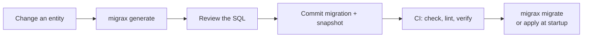

---
hide:
  - navigation
  - toc
---

<div class="mx-hero" markdown>

# Your entities change.<br>Migrax writes the migration.

<p class="mx-tagline">Migrax reads your JPA entities, compares them with what your database looks like,
and writes the SQL migration for you, with a rollback script, linted for locking and data loss,
and verified by your own Hibernate version before it reaches production.</p>

[Get started](getting-started/installation.md){ .md-button .md-button--primary }
[:material-download: Download](download.md){ .md-button }
[Quick start in 5 minutes](getting-started/quickstart.md){ .md-button }

</div>

## See it in 30 seconds

Add a field to an entity:

```java hl_lines="9"
@Entity
@Table(name = "customers")
public class Customer {
    @Id
    @GeneratedValue(strategy = GenerationType.IDENTITY)
    public Long id;

    public String email;
    public String phone;      // new
}
```

Ask Migrax for the migration:

```console
$ migrax generate
Created src/main/resources/db/migration/0002_add_customers_phone.sql:
  - add column customers.phone
Rollback script written to src/main/resources/db/migration/rollback.
Review the SQL, then run 'migrax migrate'.

$ migrax migrate
Applying migration '0002_add_customers_phone.sql'...
Successfully applied migration '0002_add_customers_phone.sql'.
```

The migration is plain SQL you can read, review and commit:

```sql title="0002_add_customers_phone.sql"
-- Generated by Migrax 0.1.2 for postgresql

ALTER TABLE customers ADD COLUMN phone varchar(255);
```

## Why teams use Migrax

<div class="grid cards" markdown>

-   :material-auto-fix:{ .lg .middle } __Migrations written for you__

    ---

    Change an entity, run `migrax generate`. Tables, columns, keys, indexes, join tables,
    element collections, sequences and inheritance come out exactly as Hibernate maps them.

-   :material-shield-check:{ .lg .middle } __Checked before production__

    ---

    Every migration is linted for statements that lock big tables, fail on existing rows or
    break running instances. `migrax verify` has your Hibernate version validate the result.

-   :material-undo-variant:{ .lg .middle } __Rollback included__

    ---

    Each generated migration comes with a rollback script, and `verify` proves it works by
    rolling everything back and forward again.

-   :material-account-question:{ .lg .middle } __Asks before it loses data__

    ---

    A dropped column that looks renamed? Migrax asks, and renames it so the data stays.
    Drops only happen when you say `--allow-destructive`.

-   :material-radar:{ .lg .middle } __Catches manual changes__

    ---

    `migrax drift` compares the live database with what your migrations produce and lists
    every difference, including columns someone made narrower.

-   :material-cog-outline:{ .lg .middle } __Zero setup__

    ---

    Run it in your service folder. It compiles the project, finds the dependencies and reads
    the database settings from your application configuration.

</div>

## Works with your stack

| | Supported |
|---|---|
| **Frameworks** | Spring Boot, Quarkus, Micronaut 4 and 5, Helidon 4, Jakarta EE and plain Hibernate |
| **Hibernate** | 5.4 to 7.4, each version reading and validating its own mapping ([details](reference/hibernate.md)) |
| **Databases** | PostgreSQL, MySQL 8, MariaDB, SQL Server, Oracle 12c+, H2 |
| **Build tools** | Maven and Gradle, both detected automatically, plus plugins for each |
| **Ways to run** | Command line, Maven plugin, Gradle plugin, and at application startup |

## How it fits your workflow



Migrations are ordinary SQL files in `src/main/resources/db/migration`. Nothing is hidden:
you can read, edit and review every statement before it runs.

[Install Migrax :material-arrow-right:](getting-started/installation.md){ .md-button .md-button--primary }
